# Nest Mart & Grocery - E-commerce Retail Web Application
Welcome to my personal project - Nest Mart & Grocery, a web application designed for an seamless shopping experience with full functionalities from a real-world e-commerce website.

## Demo Video
You can view my app demo here

# Database schema
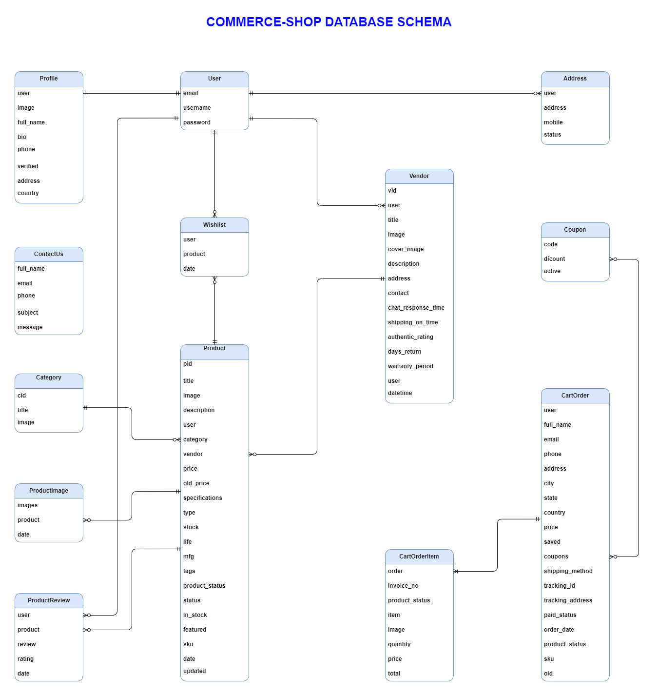
*Nest Database schema.*

# Features

## Customer & User
- Login/ Registration.
- Search/ Filter products by title, category, tag, price.
- View product details.
- Add review and rating on product
- Edit profile/ address.
- View order dashboard.
- View order detail
- Send feedback to websites.
- Add/ remove items in wishlist.
- Add/ remove/ edit item in shopping cart
- Place order and Checkout with Stripe/Paypal
- View/ Print invoice.

## Admin
- Manage product (CRUD).
- View orders sales data.
- View orders detail/
- Update order status.
- Update profile settings.
- View customer reviews.
- Change password.

# Screenshots

*Main page.*

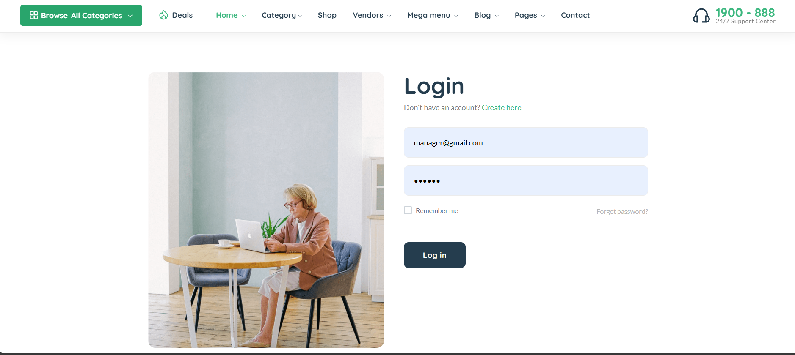
*Authentication page.*

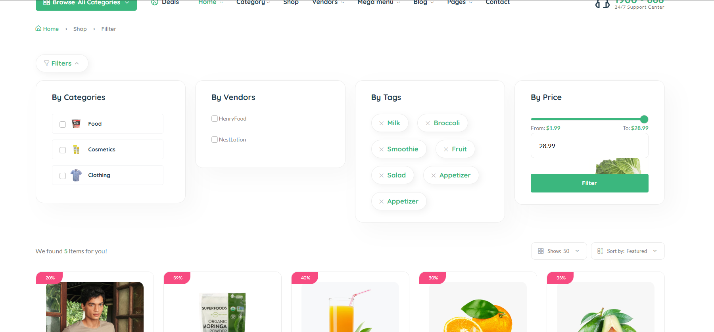
*Product Filter.*

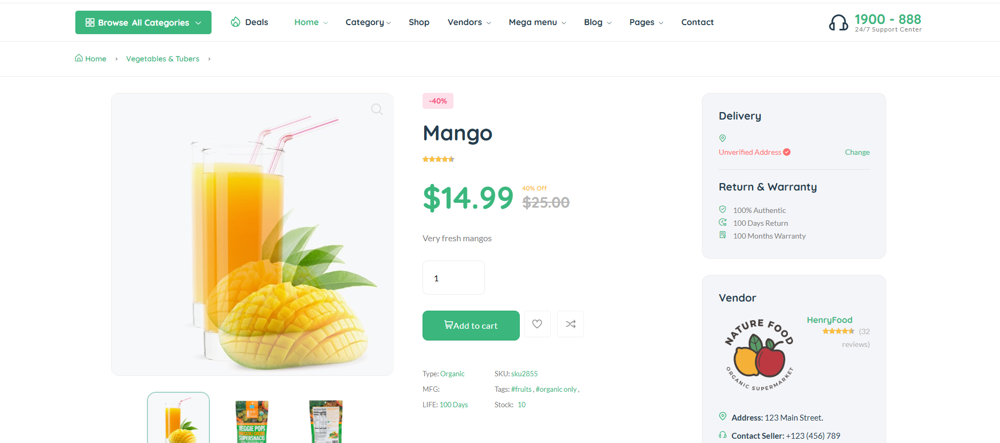
*Product detail.*

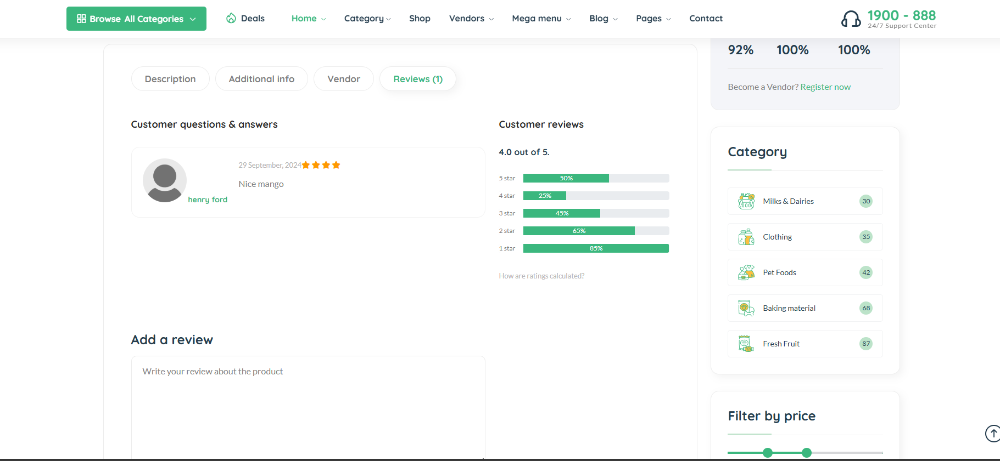
*Product review.*

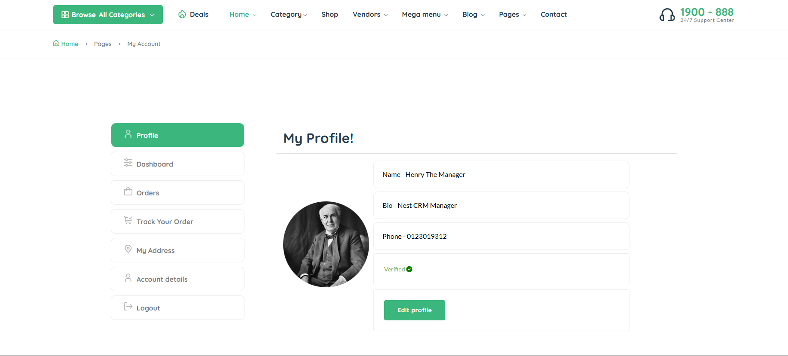
*Profile page.*

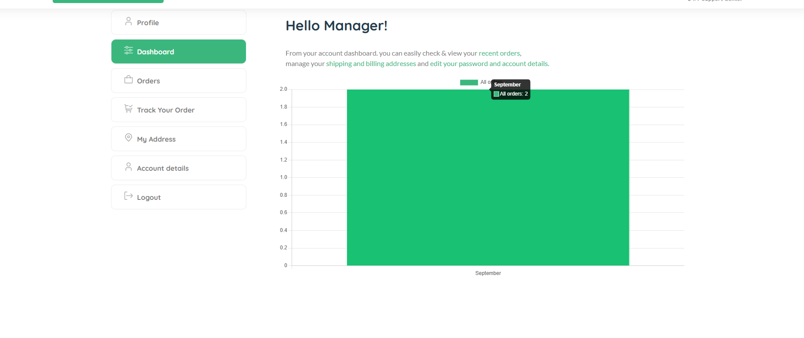
*Order dashboard.*

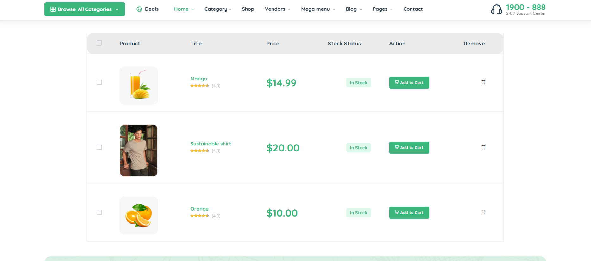
*Wishlist page.*

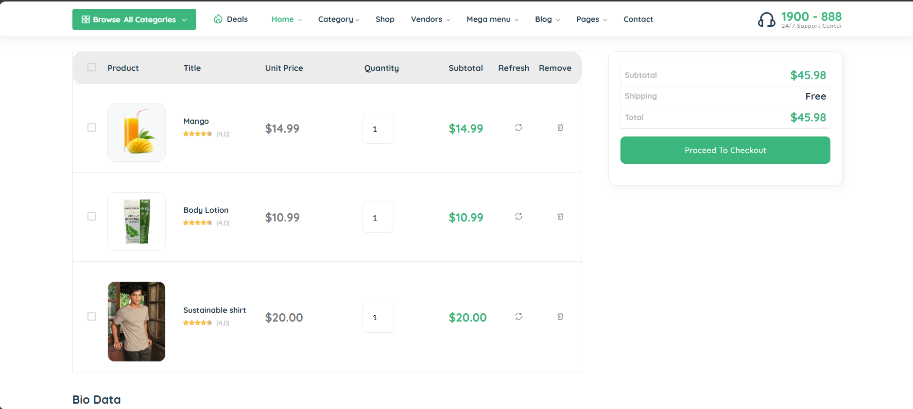
*Cart page.*

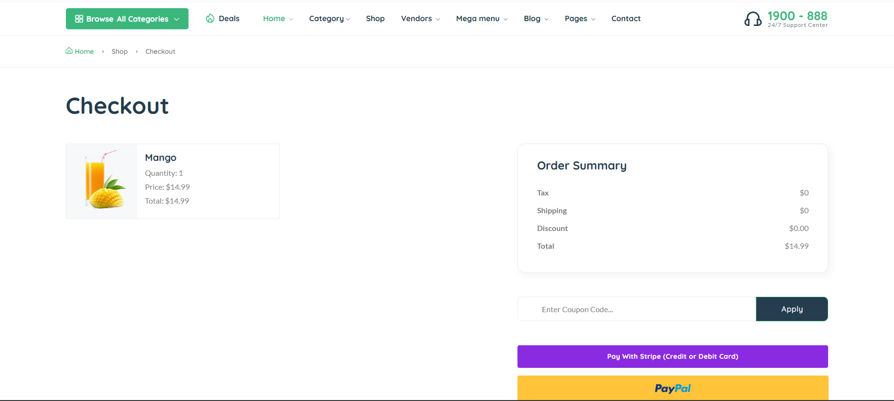
*Checkout page.*

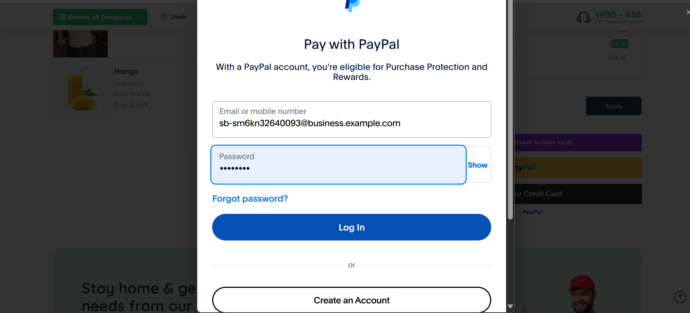
*Paypal payment method.*

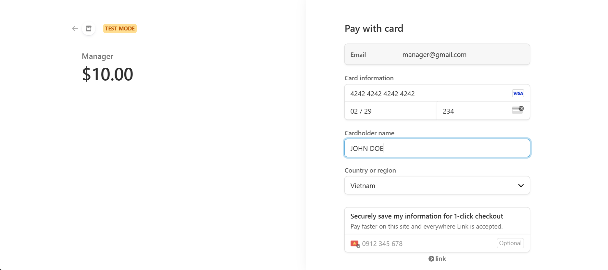
*Stripe payment method.*

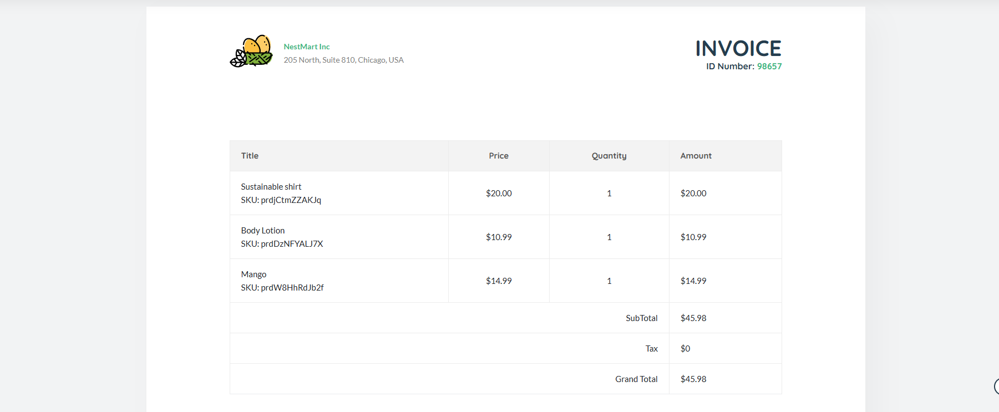
*Invoice page.*

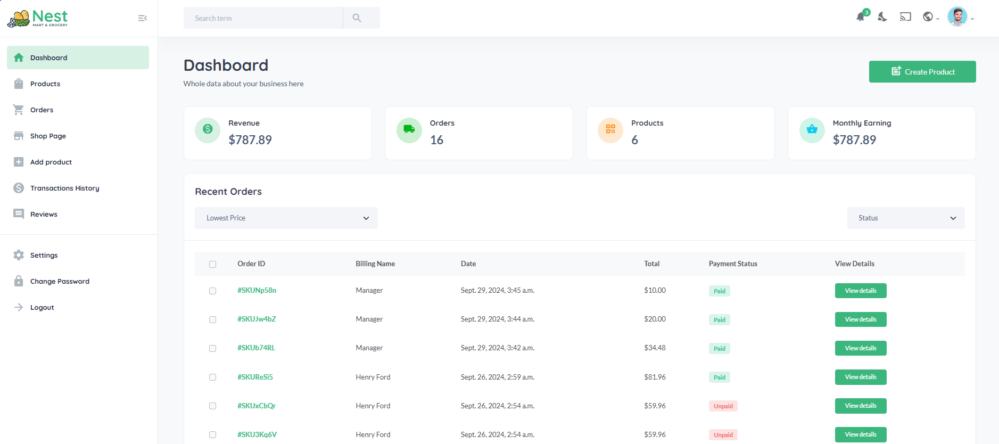
*Admin dashboard.*

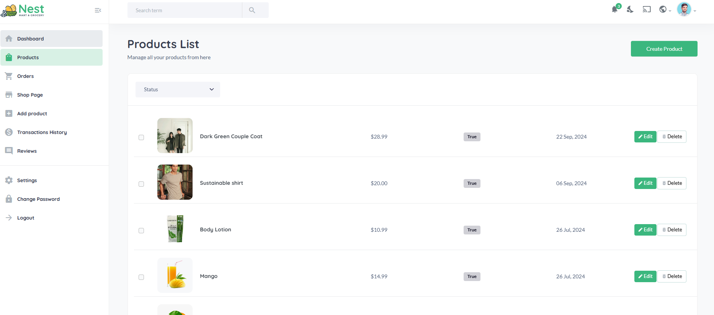
*Admin products page.*

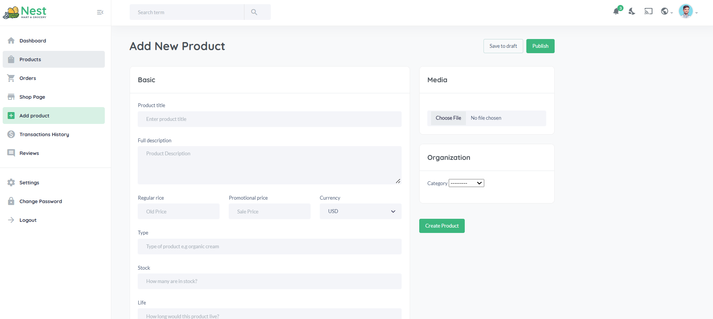
*Admin add product page.*

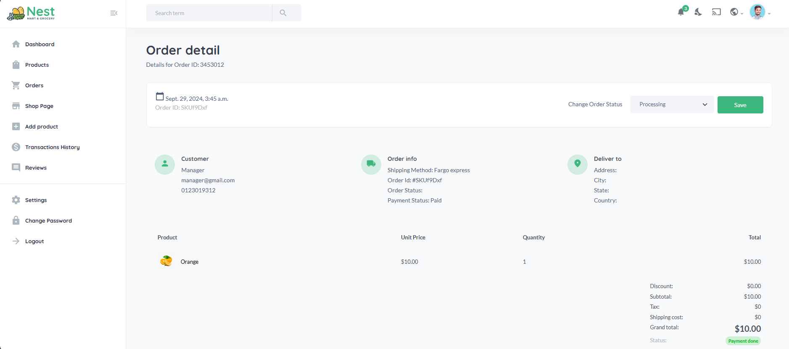
*Admin order detail page.*

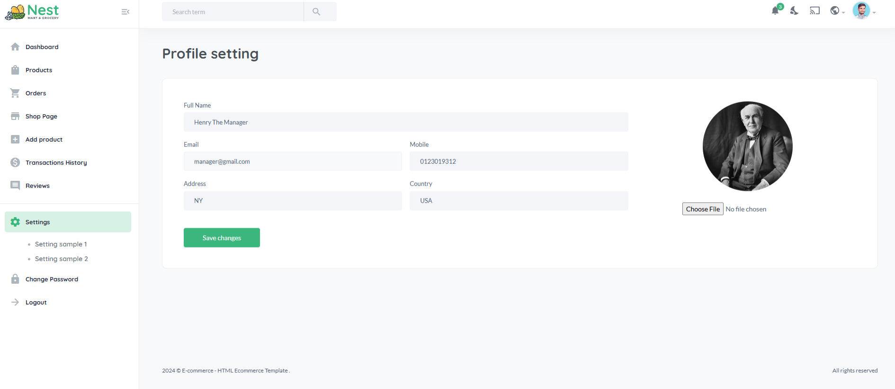
*Admin settings page.*

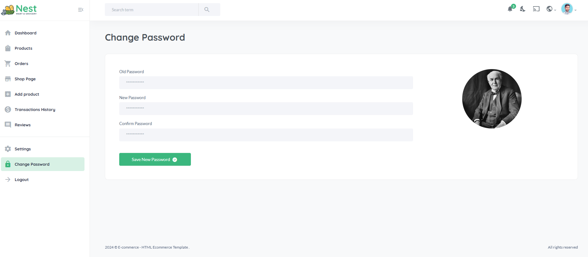
*Admin change password page.*

